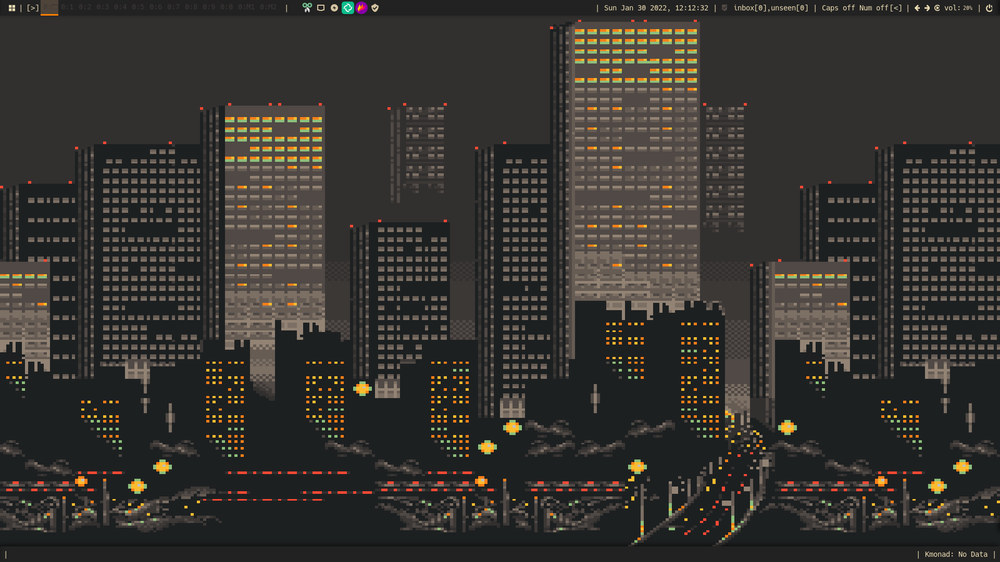

# Dotfiles
You feel you've seen this repository before...

Hello!

I'm Dunkmania101 and this repository holds my dotfiles.
Feel free to look around!

#

Here are some screenshots:

The wallpaper is called "Streets of Gruvbox". I found it on Reddit.

The wallpaper behind the wall of terminal emulators is something I like to call *`Shrek Astley`*, converted to the Gruvbox color scheme using [ImageGoNord](https://ign.schrodinger-hat.it/)

#

